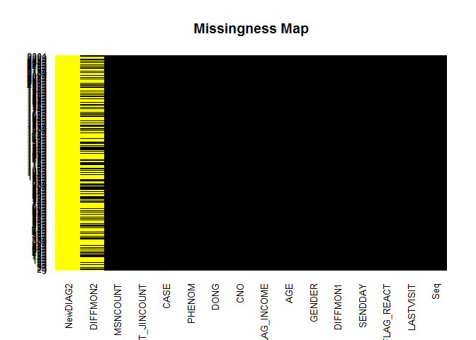
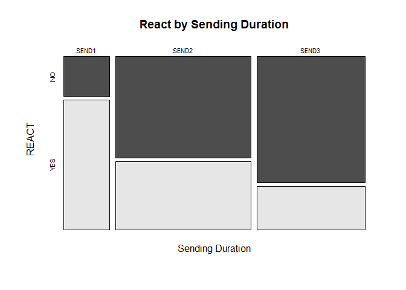
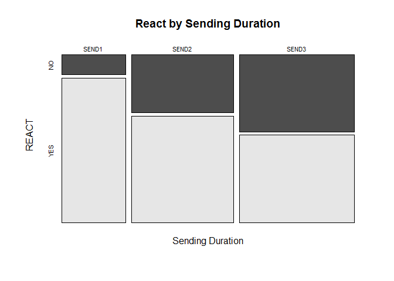
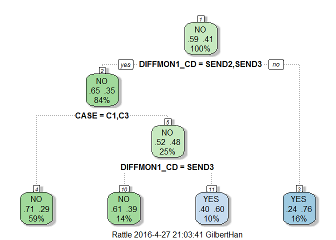
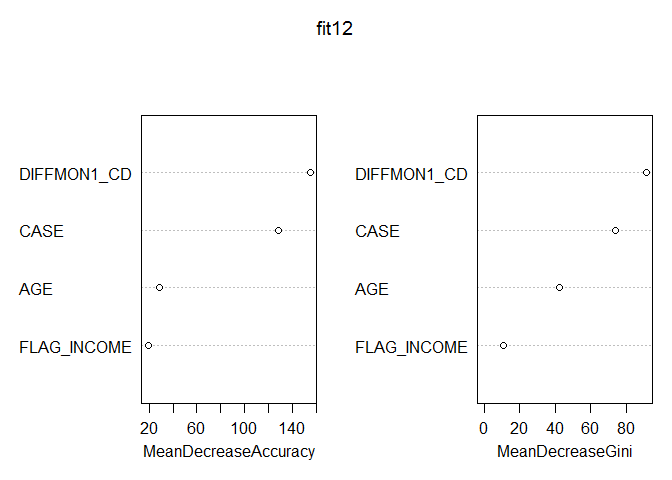
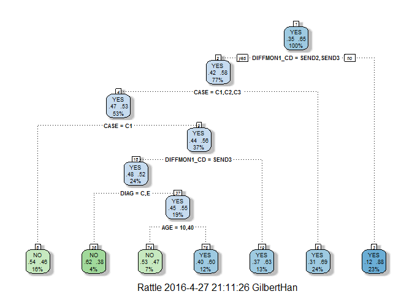
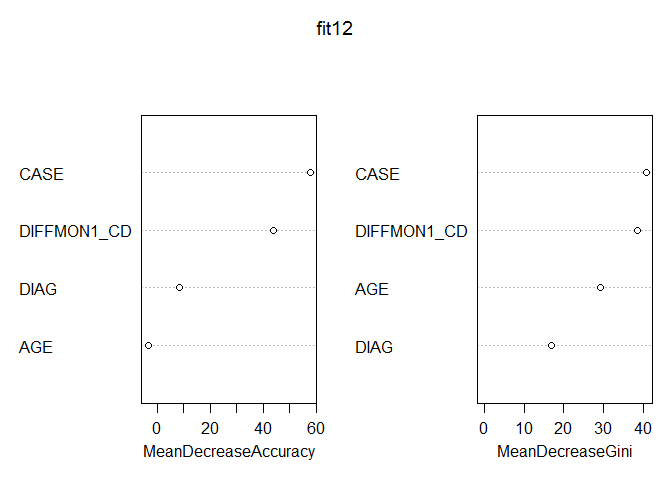
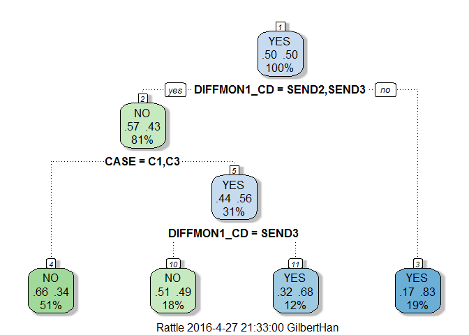
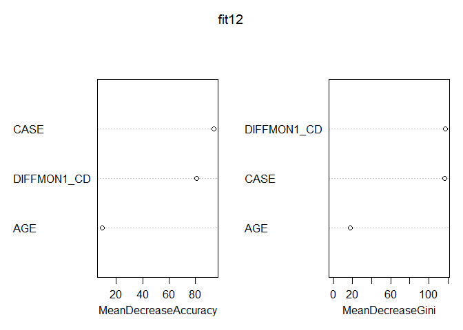

1. Getting the Data Into R
--------------------------

-   데이터셋 불러오기

<!-- -->

    setwd("~/GitHub/Hospital")
    dataset1 <- read.csv("dataset1_PHENOM.csv") #병명이 식별되지 않는 그룹
    dataset2 <- read.csv("dataset2_PHENOM.csv") #병명이 식별되는 그룹.

2. Munging
----------

-   각 데이터셋에 NA 값이 어떻게 분포되어 있는지 확인하기 (`Amelia`
    package의 함수를 이용)

<!-- -->

    library(Amelia)

    missmap(dataset1, col=c("yellow", "black"), legend=FALSE)

<!-- -->
`NewDIAG2(병명)`과 `DIFFMON2(문자받은 후 재검응답까지 개월수)`에 NA값이
존재

    missmap(dataset2, col=c("yellow", "black"), legend=FALSE)

<!-- -->
`DIFFMON2(문자받은 후 재검응답까지 개월수)`에 NA값이 존재

잘못들어간 데이터 제거

    dataset1 <- subset(dataset1, !is.na(dataset1$Seq))
    dataset2 <- subset(dataset2, !is.na(dataset2$Seq))

-   몇몇 변수 데이터형식 바꾸기

<!-- -->

    dataset1$AGE <- as.factor(dataset1$AGE)
    dataset2$AGE <- as.factor(dataset2$AGE)

    dataset1$FLAG_INCOME <- as.factor(dataset1$FLAG_INCOME)
    dataset2$FLAG_INCOME <- as.factor(dataset2$FLAG_INCOME)

    dataset1$DIFFMON2 <- as.integer(dataset1$DIFFMON2)
    dataset2$DIFFMON2 <- as.integer(dataset2$DIFFMON2)

-   예측하고자 하는 변수는 범주형으로 변환

<!-- -->

    dataset1$FLAG_REACT[dataset1$FLAG_REACT ==0] <- "NO"
    dataset1$FLAG_REACT[dataset1$FLAG_REACT ==1] <- "YES"
    dataset2$FLAG_REACT[dataset2$FLAG_REACT ==0] <- "NO"
    dataset2$FLAG_REACT[dataset2$FLAG_REACT ==1] <- "YES"
    dataset1$FLAG_REACT <- as.factor(dataset1$FLAG_REACT)
    dataset2$FLAG_REACT <- as.factor(dataset2$FLAG_REACT)

-   병명 업데이트 먼저 병명별 건수 확인하기

<!-- -->

    table(dataset2$NewDIAG2)

    ## 
    ## C5040 C5041 C5051   C73 D0509  D171   d24   D24  D240 D2409   D34  D360 
    ##     4     1     1     8     1     3     2   575    72    40   421     2 
    ##  E039 E0500  E059  E069  N601  N608   N61   N62  N644   R53 
    ##    29   350     2    70     1     3     2     5     2     1

병명을 `C, D, E, N`으로 범주화하여 합치기

    dataset2 <- within( dataset2, {
        DIAG = character(0)
        DIAG[ grep("C", dataset2$NewDIAG2)] = "C"
        DIAG[ grep("d", dataset2$NewDIAG2)] = "D"
        DIAG[ grep("D", dataset2$NewDIAG2)] = "D"
        DIAG[ grep("E", dataset2$NewDIAG2)] = "E"
        DIAG[ grep("N", dataset2$NewDIAG2)] = "N"
        DIAG[ grep("R", dataset2$NewDIAG2)] = "N" #R은 N으로 합치기
        DIAG = factor(DIAG, level = c("C", "D", "E","N"))})

    table(dataset2$DIAG,useNA = "always")

    ## 
    ##    C    D    E    N <NA> 
    ##   14 1116  451   14    0

-   최근방문일~문자발송 개월수를 4개월이내, 5~7개월, 8개월이상으로
    분할하고 범주화

<!-- -->

    dataset1 <- within( dataset1, {
        DIFFMON1_CD = character(0)
        DIFFMON1_CD[ DIFFMON1 >=0 & DIFFMON1 <4 ] = "SEND1"
        DIFFMON1_CD[ DIFFMON1 >=4 & DIFFMON1 <8 ] = "SEND2"
        DIFFMON1_CD[ DIFFMON1 >=8 ] = "SEND3"
        DIFFMON1_CD = factor(DIFFMON1_CD, level = c("SEND1", "SEND2", "SEND3"))})

    dataset2 <- within( dataset2, {
        DIFFMON1_CD = character(0)
        DIFFMON1_CD[ DIFFMON1 >=0 & DIFFMON1 <4 ] = "SEND1"
        DIFFMON1_CD[ DIFFMON1 >=4 & DIFFMON1 <8 ] = "SEND2"
        DIFFMON1_CD[ DIFFMON1 >=8 ] = "SEND3"
        DIFFMON1_CD = factor(DIFFMON1_CD, level = c("SEND1", "SEND2", "SEND3"))})

문자발송 개월 구간별 반응 확인

    mosaicplot(dataset1$DIFFMON1_CD ~ dataset1$FLAG_REACT, 
               main="React by Sending Duration", shade=FALSE, 
               color=TRUE, xlab="Sending Duration", ylab="REACT")

<!-- -->

    mosaicplot(dataset2$DIFFMON1_CD ~ dataset2$FLAG_REACT, 
               main="React by Sending Duration", shade=FALSE, 
               color=TRUE, xlab="Sending Duration", ylab="REACT")

<!-- -->

-   문자발송일~재검응답 개월수를 3개월이내, 4개월이상, 무반응으로
    분할하고 범주화

<!-- -->

    dataset1 <- within( dataset1, {
        DIFFMON2_CD = character(0)
        DIFFMON2_CD[ DIFFMON2 >=0 & DIFFMON2 <3 ] = "REACT1"
        DIFFMON2_CD[ DIFFMON2 >=3 ] = "REACT2"
        DIFFMON2_CD[ is.na(DIFFMON2) ] = "NO_REACT"
        DIFFMON2_CD = factor(DIFFMON2_CD, level = c("REACT1", "REACT2", "NO_REACT"))})

    dataset2 <- within( dataset2, {
        DIFFMON2_CD = character(0)
        DIFFMON2_CD[ DIFFMON2 >=0 & DIFFMON2 <3 ] = "REACT1"
        DIFFMON2_CD[ DIFFMON2 >=3 ] = "REACT2"
        DIFFMON2_CD[ is.na(DIFFMON2) ] = "NO_REACT"
        DIFFMON2_CD = factor(DIFFMON2_CD, level = c("REACT1", "REACT2", "NO_REACT"))})

    table(dataset1$DIFFMON2_CD)

    ## 
    ##   REACT1   REACT2 NO_REACT 
    ##      537      400     1367

    table(dataset2$DIFFMON2_CD)

    ## 
    ##   REACT1   REACT2 NO_REACT 
    ##      582      462      551

    ds <- rbind(dataset1[, c("Seq", "FLAG_REACT", "DIFFMON1_CD", "CASE", "AGE", "FLAG_INCOME")], dataset2[,c("Seq", "FLAG_REACT", "DIFFMON1_CD", "CASE", "AGE", "FLAG_INCOME")]) #병명과 상관없는 전체 데이터

3. Fitting a Model
------------------

-   train set, test set 만들기

<!-- -->

    set.seed(10)
    sub1 <- sample(nrow(dataset1), floor(nrow(dataset1) * 0.8))
    ds1_train0 <- dataset1[sub1, ]
    ds1_test0 <- dataset1[-sub1, ]

    sub2 <- sample(nrow(dataset2), floor(nrow(dataset2) * 0.8))
    ds2_train0 <- dataset2[sub2, ]
    ds2_test0 <- dataset2[-sub2, ]

    sub3 <- sample(nrow(ds), floor(nrow(ds) * 0.8))
    ds_train0 <- ds[sub3, ]
    ds_test0 <- ds[-sub3, ]

각 세트의 건수 확인

    nrow(ds1_train0)

    ## [1] 1843

    nrow(ds1_test0)

    ## [1] 461

    nrow(ds2_train0)

    ## [1] 1276

    nrow(ds2_test0)

    ## [1] 319

    nrow(ds_train0)

    ## [1] 3119

    nrow(ds_test0)

    ## [1] 780

-   필요한 라이브러리 로딩

<!-- -->

    library(caret)
    library(e1071)
    library(pROC)
    library(ada)
    library(rpart)
    library(rattle)

### 3.1 병명 없는 데이터

1)logistic regression

    cv.ctrl <- trainControl(method = "repeatedcv", repeats = 3,
                            summaryFunction = twoClassSummary,classProbs = TRUE)

    tune.1.1 <- train(FLAG_REACT ~ DIFFMON1_CD + CASE + AGE,
                      data = ds1_train0, method = "glm",
                      metric = "ROC",  trControl = cv.ctrl)

    # 적용
    Prediction <- predict(tune.1.1, ds1_test0)

    #정확도 계산 
    submit <- data.frame(Seq = ds1_test0$Seq, PREDICT_REACT = Prediction)
    result <- merge(ds1_test0, submit, by = "Seq")
    nrow(result[result$FLAG_REACT == result$PREDICT_REACT,]) / nrow(result)

    ## [1] 0.70282

1.  AdaBoost

<!-- -->

    ## note the dot preceding each variable
    ada.grid <- expand.grid(.iter = c(50, 100), .maxdepth = c(4, 8), .nu = c(0.1, 1))

    ##Specify method=”ada” and tuneGrid=ada.grid in train, and away we go...
    ada.tune <- train(FLAG_REACT ~ DIFFMON1_CD + CASE + AGE, data = ds1_train0,
                      method = "ada", metric = "ROC", tuneGrid = ada.grid,
                      trControl = cv.ctrl)

    # 적용
    Prediction <- predict(ada.tune, ds1_test0)

    # 정확도 계산
    submit <- data.frame(Seq = ds1_test0$Seq, PREDICT_REACT = Prediction)
    result <- merge(ds1_test0, submit, by = "Seq")
    nrow(result[result$FLAG_REACT == result$PREDICT_REACT,]) / nrow(result)

    ## [1] 0.6984816

1.  Random Forest 1

<!-- -->

    rf.grid <- data.frame(.mtry = c(2, 3))

    rf.tune <- train(FLAG_REACT ~ DIFFMON1_CD + CASE + AGE, data = ds1_train0,
                     method = "rf", metric = "ROC", tuneGrid = rf.grid,
                     trControl = cv.ctrl)

    # 적용
    Prediction <- predict(rf.tune, ds1_test0)

    # 정확도 계산
    submit <- data.frame(Seq = ds1_test0$Seq, PREDICT_REACT = Prediction)
    result <- merge(ds1_test0, submit, by = "Seq")
    nrow(result[result$FLAG_REACT == result$PREDICT_REACT,]) / nrow(result)

    ## [1] 0.6963124

1.  support vector machine (SVM) model

<!-- -->

    svm.tune <- train(FLAG_REACT ~ DIFFMON1_CD + CASE + AGE,  data = ds1_train0,
                      method = "svmRadial", tuneLength = 9, preProcess = c("center", "scale"),
                      metric = "ROC", trControl = cv.ctrl)

    # 적용
    Prediction <- predict(svm.tune, ds1_test0)

    # 정확도 계산
    submit <- data.frame(Seq = ds1_test0$Seq, PREDICT_REACT = Prediction)
    result <- merge(ds1_test0, submit, by = "Seq")
    nrow(result[result$FLAG_REACT == result$PREDICT_REACT,]) / nrow(result)

    ## [1] 0.6963124

1.  의사결정트리

<!-- -->

    fit11 <- rpart(FLAG_REACT ~ DIFFMON1_CD + CASE + AGE + FLAG_INCOME
                   ,data=ds1_train0, method="class")

    fancyRpartPlot(fit11)

<!-- -->

    # 적용
    Prediction <- predict(fit11, ds1_test0, type = "class")

    # 정확도 계산
    submit <- data.frame(Seq = ds1_test0$Seq, PREDICT_REACT = Prediction)
    result <- merge(ds1_test0, submit, by = "Seq")
    nrow(result[result$FLAG_REACT == result$PREDICT_REACT,])/nrow(result)

    ## [1] 0.7071584

1.  Random Forest 2

<!-- -->

    fit12 <- randomForest(as.factor(FLAG_REACT) ~ DIFFMON1_CD + CASE + AGE + FLAG_INCOME
                          , data=ds1_train0, importance=TRUE, ntree=2000)

    varImpPlot(fit12)

<!-- -->

    # 적용
    Prediction <- predict(fit12, ds1_test0)

    # 정확도 계산
    submit1 <- data.frame(Seq = ds1_test0$Seq, PREDICT_REACT = Prediction)
    result <- merge(ds1_test0, submit1, by = "Seq")
    nrow(result[result$FLAG_REACT == result$PREDICT_REACT,])/nrow(result)

    ## [1] 0.7114967

3.2 병명 있는 데이터터
----------------------

1.  logistic regression

<!-- -->

    cv.ctrl <- trainControl(method = "repeatedcv", repeats = 3,
                            summaryFunction = twoClassSummary,classProbs = TRUE)

    tune.2.1 <- train(FLAG_REACT ~ DIFFMON1_CD + CASE + DIAG
                      ,data = ds2_train0, method = "glm",
                      metric = "ROC",  trControl = cv.ctrl)

    # 적용
    Prediction <- predict(tune.2.1, ds2_test0)

    # 정확도 계산 
    submit <- data.frame(Seq = ds2_test0$Seq, PREDICT_REACT = Prediction)
    result <- merge(ds1_test0, submit, by = "Seq")
    nrow(result[result$FLAG_REACT == result$PREDICT_REACT,]) / nrow(result)

    ## [1] 0.4558824

1.  AdaBoost

<!-- -->

    ## note the dot preceding each variable
    ada.grid <- expand.grid(.iter = c(50, 100), .maxdepth = c(4, 8), .nu = c(0.1, 1))

    ##Specify method=”ada” and tuneGrid=ada.grid in train, and away we go...
    ada.tune <- train(FLAG_REACT ~ DIFFMON1_CD + CASE + DIAG, data = ds2_train0,
                      method = "ada", metric = "ROC", tuneGrid = ada.grid,
                      trControl = cv.ctrl)

    # 적용
    Prediction <- predict(ada.tune, ds2_test0)

    # 정확도 계산
    submit <- data.frame(Seq = ds2_test0$Seq, PREDICT_REACT = Prediction)
    result <- merge(ds2_test0, submit, by = "Seq")
    nrow(result[result$FLAG_REACT == result$PREDICT_REACT,]) / nrow(result)

    ## [1] 0.7021944

1.  Random Forest 1

<!-- -->

    rf.grid <- data.frame(.mtry = c(2, 3))

    rf.tune.2 <- train(FLAG_REACT ~ DIFFMON1_CD + CASE + DIAG + AGE, data = ds2_train0,
                       method = "rf", metric = "ROC", tuneGrid = rf.grid,
                       trControl = cv.ctrl)

    # 적용
    Prediction <- predict(rf.tune, ds2_test0)

    # 정확도 계산
    submit <- data.frame(Seq = ds2_test0$Seq, PREDICT_REACT = Prediction)
    result <- merge(ds2_test0, submit, by = "Seq")
    nrow(result[result$FLAG_REACT == result$PREDICT_REACT,]) / nrow(result)

    ## [1] 0.5956113

1.  support vector machine (SVM) model

<!-- -->

    svm.tune <- train(FLAG_REACT ~ DIFFMON1_CD + CASE +  DIAG +AGE,  data = ds2_train0,
                      method = "svmRadial", tuneLength = 9, preProcess = c("center", "scale"),
                      metric = "ROC", trControl = cv.ctrl)

    # 적용
    Prediction <- predict(svm.tune, ds2_test0)

    # 정확도 계산
    submit <- data.frame(Seq = ds2_test0$Seq, PREDICT_REACT = Prediction)
    result <- merge(ds2_test0, submit, by = "Seq")
    nrow(result[result$FLAG_REACT == result$PREDICT_REACT,]) / nrow(result)

    ## [1] 0.6896552

1.  의사결정트리

<!-- -->

    fit12 <- rpart(FLAG_REACT ~ DIFFMON1_CD + CASE + DIAG +AGE
                   ,data=ds2_train0, method="class")

    fancyRpartPlot(fit12)

<!-- -->

    # 적용 및 정확도 계산
    Prediction <- predict(fit11, ds2_test0, type = "class")
    submit <- data.frame(Seq = ds2_test0$Seq, PREDICT_REACT = Prediction)
    result <- merge(ds2_test0, submit, by = "Seq")
    nrow(result[result$FLAG_REACT == result$PREDICT_REACT,])/nrow(result)

    ## [1] 0.6144201

1.  Random Forest 2

<!-- -->

    fit12 <- randomForest(as.factor(FLAG_REACT) ~ DIFFMON1_CD + CASE + DIAG +AGE
                          , data=ds2_train0, importance=TRUE, ntree=2000)

    varImpPlot(fit12)

<!-- -->

    # 적용
    Prediction <- predict(fit12, ds2_test0)

    #  및 정확도 계산
    submit1 <- data.frame(Seq = ds2_test0$Seq, PREDICT_REACT = Prediction)
    result <- merge(ds2_test0, submit1, by = "Seq")
    nrow(result[result$FLAG_REACT == result$PREDICT_REACT,])/nrow(result)

    ## [1] 0.6833856

3.4 통합데이터
--------------

1.  logistic regression

<!-- -->

    cv.ctrl <- trainControl(method = "repeatedcv", repeats = 3,
                            summaryFunction = twoClassSummary,classProbs = TRUE)

    tune.1 <- train(FLAG_REACT ~ DIFFMON1_CD + CASE + AGE
                      ,data = ds_train0, method = "glm",
                      metric = "ROC",  trControl = cv.ctrl)

    # 적용
    Prediction <- predict(tune.1, ds_test0)

    # 정확도 계산 
    submit <- data.frame(Seq = ds_test0$Seq, PREDICT_REACT = Prediction)
    result <- merge(ds_test0, submit, by = "Seq")
    nrow(result[result$FLAG_REACT == result$PREDICT_REACT,]) / nrow(result)

    ## [1] 0.6004415

1.  AdaBoost

<!-- -->

    ## note the dot preceding each variable
    ada.grid <- expand.grid(.iter = c(50, 100), .maxdepth = c(4, 8), .nu = c(0.1, 1))

    ##Specify method=”ada” and tuneGrid=ada.grid in train, and away we go...
    ada.tune <- train(FLAG_REACT ~ DIFFMON1_CD + CASE + AGE, data = ds_train0,
                      method = "ada", metric = "ROC", tuneGrid = ada.grid,
                      trControl = cv.ctrl)

    # 적용
    Prediction <- predict(ada.tune, ds_test0)

    # 정확도 계산
    submit <- data.frame(Seq = ds_test0$Seq, PREDICT_REACT = Prediction)
    result <- merge(ds_test0, submit, by = "Seq")
    nrow(result[result$FLAG_REACT == result$PREDICT_REACT,]) / nrow(result)

    ## [1] 0.6048565

1.  Random Forest 1

<!-- -->

    rf.grid <- data.frame(.mtry = c(2, 3))

    rf.tune <- train(FLAG_REACT ~ DIFFMON1_CD + CASE + AGE, data = ds_train0,
                       method = "rf", metric = "ROC", tuneGrid = rf.grid,
                       trControl = cv.ctrl)

    # 적용
    Prediction <- predict(rf.tune, ds_test0)

    # 정확도 계산
    submit <- data.frame(Seq = ds_test0$Seq, PREDICT_REACT = Prediction)
    result <- merge(ds_test0, submit, by = "Seq")
    nrow(result[result$FLAG_REACT == result$PREDICT_REACT,]) / nrow(result)

    ## [1] 0.6059603

1.  support vector machine (SVM) model

<!-- -->

    svm.tune <- train(FLAG_REACT ~ DIFFMON1_CD + CASE +  AGE,  data = ds_train0,
                      method = "svmRadial", tuneLength = 9, preProcess = c("center", "scale"),
                      metric = "ROC", trControl = cv.ctrl)

    # 적용
    Prediction <- predict(svm.tune, ds_test0)

    # 정확도 계산
    submit <- data.frame(Seq = ds_test0$Seq, PREDICT_REACT = Prediction)
    result <- merge(ds_test0, submit, by = "Seq")
    nrow(result[result$FLAG_REACT == result$PREDICT_REACT,]) / nrow(result)

    ## [1] 0.6004415

1.  의사결정트리

<!-- -->

    fit12 <- rpart(FLAG_REACT ~ DIFFMON1_CD + CASE + AGE
                   ,data=ds_train0, method="class")

    fancyRpartPlot(fit12)

<!-- -->

    # 적용 및 정확도 계산
    Prediction <- predict(fit11, ds_test0, type = "class")
    submit <- data.frame(Seq = ds_test0$Seq, PREDICT_REACT = Prediction)
    result <- merge(ds_test0, submit, by = "Seq")
    nrow(result[result$FLAG_REACT == result$PREDICT_REACT,])/nrow(result)

    ## [1] 0.607064

1.  Random Forest 2

<!-- -->

    fit12 <- randomForest(as.factor(FLAG_REACT) ~ DIFFMON1_CD + CASE + AGE
                          , data=ds_train0, importance=TRUE, ntree=2000)

    varImpPlot(fit12)

<!-- -->

    # 적용
    Prediction <- predict(fit12, ds_test0)

    #  및 정확도 계산
    submit1 <- data.frame(Seq = ds_test0$Seq, PREDICT_REACT = Prediction)
    result <- merge(ds2_test0, submit1, by = "Seq")
    nrow(result[result$FLAG_REACT == result$PREDICT_REACT,])/nrow(result)

    ## [1] 0.5165563
