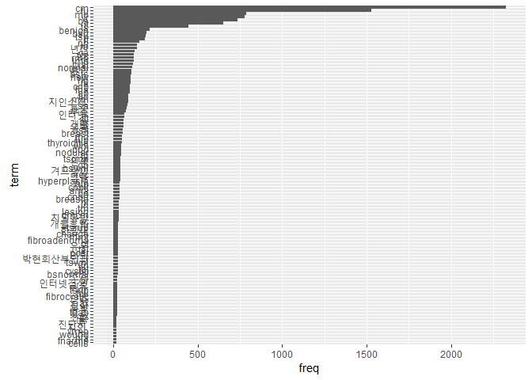
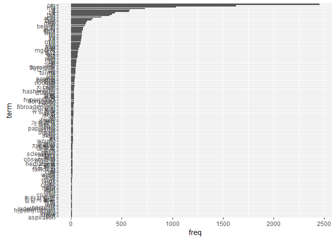
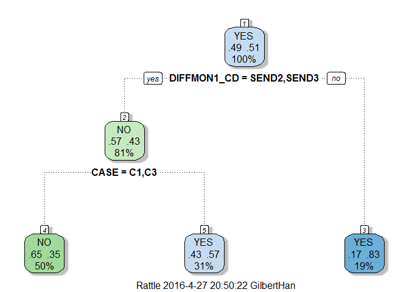
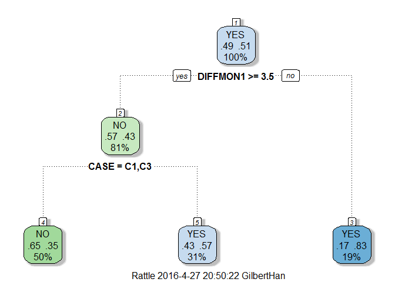
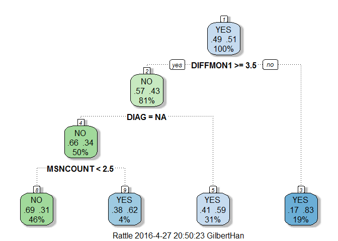
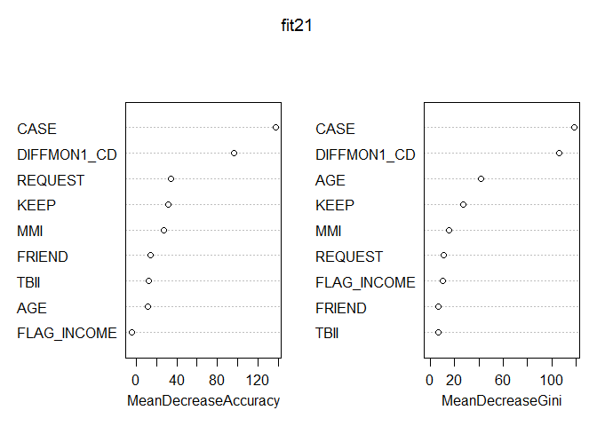
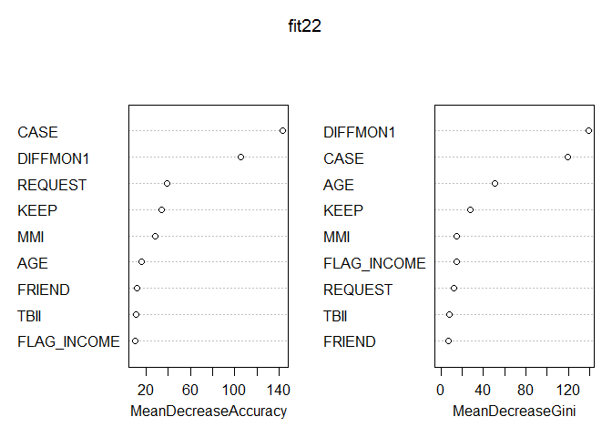
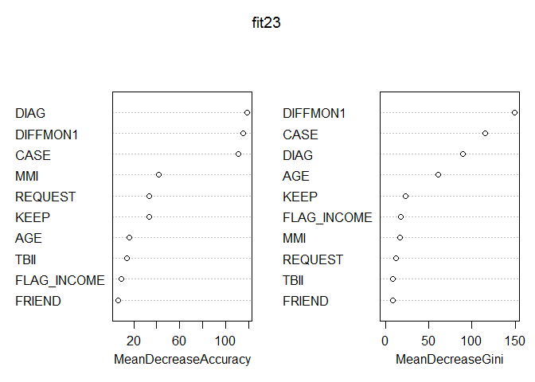
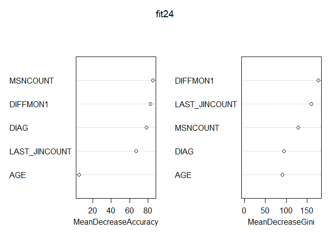

\#\# 1. Getting the Data Into R
-------------------------------

-   데이터셋 불러오기

<!-- -->

    setwd("~/GitHub/Hospital")
    dataset1 <- read.csv("dataset1_PHENOM.csv") #병명이 식별되지 않는 그룹
    dataset2 <- read.csv("dataset2_PHENOM.csv") #병명이 식별되는 그룹.

    ds <- rbind(dataset1, dataset2)

\#\# 2. data munging
--------------------

-   잘못 들어간 데이터 제거

<!-- -->

    ds <- subset(ds, GENDER != '')
    ds$GENDER <- as.character(ds$GENDER)
    ds$GENDER <- as.factor(ds$GENDER)

    ds$AGE <- as.factor(ds$AGE)

    ds$FLAG_REACT[ds$FLAG_REACT ==0] <- "NO"
    ds$FLAG_REACT[ds$FLAG_REACT ==1] <- "YES"

    ds$FLAG_REACT <- as.factor(ds$FLAG_REACT)
    ds$FLAG_INCOME <- as.factor(ds$FLAG_INCOME)

    ds$DIFFMON2 <- as.integer(ds$DIFFMON2)

-   변수를 범주형 자료로 변경
-   최근방문일~문자발송 개월수를 4개월이내, 5~7개월, 8개월이상으로
    분할하고 범주화

<!-- -->

    ds <- within( ds, {
        DIFFMON1_CD = character(0)
        DIFFMON1_CD[ DIFFMON1 >=0 & DIFFMON1 <4 ] = "SEND1"
        DIFFMON1_CD[ DIFFMON1 >=4 & DIFFMON1 <8 ] = "SEND2"
        DIFFMON1_CD[ DIFFMON1 >=8 ] = "SEND3"
        DIFFMON1_CD = factor(DIFFMON1_CD, level = c("SEND1", "SEND2", "SEND3"))})

    table(ds$DIFFMON1_CD,useNA = "always")

    ## 
    ## SEND1 SEND2 SEND3  <NA> 
    ##   726  1662  1511     0

-   문자발송일~재검 기간(월)을 3개월이내, 4개월이상, 무반응으로 분할하고
    범주화

<!-- -->

    ds <- within( ds, {
        DIFFMON2_CD = character(0)
        DIFFMON2_CD[ DIFFMON2 >=0 & DIFFMON2 <3 ] = "REACT1"
        DIFFMON2_CD[ DIFFMON2 >=3 ] = "REACT2"
        DIFFMON2_CD[ is.na(DIFFMON2) ] = "NO_REACT"
        DIFFMON2_CD = factor(DIFFMON2_CD, level = c("REACT1", "REACT2", "NO_REACT"))})

-   병명을 `C, D, E, N`으로 범주화하여 합치기

<!-- -->

    ds <- within( ds, {
        DIAG = character(0)
        DIAG[ grep("C", ds$NewDIAG2)] = "C"
        DIAG[ grep("d", ds$NewDIAG2)] = "D"
        DIAG[ grep("D", ds$NewDIAG2)] = "D"
        DIAG[ grep("E", ds$NewDIAG2)] = "E"
        DIAG[ grep("N", ds$NewDIAG2)] = "N"
        DIAG[ grep("R", ds$NewDIAG2)] = "N" #R은 N으로 합치기
        DIAG[is.na(NewDIAG2) == "TRUE"] = "NA"
        DIAG = factor(DIAG, level = c("C", "D", "E","N", "NA"))})

-   train set 과 test set 으로 구분

<!-- -->

    set.seed(20)
    sub <- sample(nrow(ds), floor(nrow(ds) * 0.8))
    ds_train <- ds[sub, ]
    ds_test <- ds[-sub, ]

-   필요한 라이브러리

<!-- -->

    library(KoNLP)
    library(tm)
    library(ggplot2)
    library(rpart)
    library(rattle)
    library(randomForest)

\#\# 4. text mining
-------------------

-   데이터 셋을 react = 1, 0으로 구분하고, 각각 상위 키워드를
    찾는다.찾은 상위 키워드를 상호 비교하여 각 그룹에만 해당되는
    키워드를 변수로 추가하여 분석한다.

<!-- -->

    ds_train_tm0 <- ds_train[ds_train$FLAG_REACT == "NO",c("FLAG_REACT","PHENOM")]
    ds_train_tm1 <- ds_train[ds_train$FLAG_REACT == "YES",c("FLAG_REACT","PHENOM")]

    useSejongDic()

    ## Backup was just finished!
    ## 87007 words were added to dic_user.txt.

\#\#\# 4.1.무반응 그룹.
-----------------------

    ds_train_tm0$PHENOM1 <- sapply(ds_train_tm0$PHENOM, function(x) {paste(extractNoun(x), collapse = " ")})

-   build corpus

<!-- -->

    Corpus0 <- Corpus(VectorSource(ds_train_tm0$PHENOM1))
    Corpus0 <- tm_map(Corpus0, removePunctuation)
    Corpus0 <- tm_map(Corpus0, removeNumbers)
    Corpus0 <- tm_map(Corpus0, tolower)
    myStopwords <- c(stopwords("english"), "rt")
    Corpus0 <- tm_map(Corpus0, removeWords, myStopwords)
    Corpus0 <- tm_map(Corpus0, PlainTextDocument)
    myTdm0 <- TermDocumentMatrix(Corpus0, control = list(wordLengths = c(2, Inf)))

    # inspect frequent term
    # findFreqTerms(myTdm0, lowfreq = 20)

    termFrequency <- rowSums(as.matrix(myTdm0))
    termFrequency <- subset(termFrequency, termFrequency >= 20)

    df_tm0 <- data.frame(term = names(termFrequency), freq = termFrequency)[order(termFrequency),]

    ggplot(df_tm0, aes(term, freq))  + coord_flip() +  geom_bar(stat="identity") + scale_x_discrete(limits=df_tm0$term)

<!-- -->

\#\#\# 4.2 반응 그룹
--------------------

    ds_train_tm1$PHENOM1 <- sapply(ds_train_tm1$PHENOM, function(x) {paste(extractNoun(x), collapse = " ")})

    # build corpus
    Corpus1 <- Corpus(VectorSource(ds_train_tm1$PHENOM1))
    Corpus1 <- tm_map(Corpus1, removePunctuation)
    Corpus1 <- tm_map(Corpus1, removeNumbers)
    Corpus1 <- tm_map(Corpus1, tolower)
    Corpus1 <- tm_map(Corpus1, removeWords, myStopwords)
    Corpus1 <- tm_map(Corpus1, PlainTextDocument)
    myTdm1 <- TermDocumentMatrix(Corpus1, control = list(wordLengths = c(2, Inf)))

    # inspect frequent term
    # findFreqTerms(myTdm1, lowfreq = 10)

    termFrequency1 <- rowSums(as.matrix(myTdm1))
    termFrequency1 <- subset(termFrequency1, termFrequency1 >= 10)

    df_tm1 <- data.frame(term = names(termFrequency1), freq = termFrequency1)[order(termFrequency1),]

    ggplot(df_tm1, aes(term, freq))  + coord_flip() +  geom_bar(stat="identity") + scale_x_discrete(limits=df_tm1$term)

<!-- -->

    row.names(df_tm0) <- NULL
    row.names(df_tm1) <- NULL

### 4.3 키워드 비교하여 여집합 구하기 ----------------------------------------------------

-   값 비교해서 겹치지 않는 것 찾기

<!-- -->

    df_tm0_term <- setdiff(df_tm0$term, df_tm1$term)
    df_tm1_term <- setdiff(df_tm1$term, df_tm0$term)

    df_tm0[df_tm0$term %in% df_tm0_term,]

    ##              term freq
    ## 2          fnarmp   20
    ## 3             hfa   20
    ## 6           지인    20
    ## 12           봄빛   22
    ## 13           정상   22
    ## 15           양측   23
    ## 20    인터넷검색    24
    ## 22           소개   25
    ## 23       bsnormal   26
    ## 28 박현희산부인과   26
    ## 29           의뢰   26
    ## 32           유두   27
    ## 47        breasts   37

    df_tm1[df_tm1$term %in% df_tm1_term,]

    ##               term freq
    ## 1       aspiration   10
    ## 2             bxrt   10
    ## 3             cnew   10
    ## 4           fnarlp   10
    ## 5              htg   10
    ## 6   hypothyroidism   10
    ## 7    indeterminate   10
    ## 8         necrosis   10
    ## 9              rfc   10
    ## 10             rml   10
    ## 11            엄마   10
    ## 12            증상   10
    ## 13     진단서 발급   10
    ## 14     진단서발급    10
    ## 15            피곤   10
    ## 17          coarse   11
    ## 18             hrt   11
    ## 19            htsh   11
    ## 20             ism   11
    ## 21            ltsh   11
    ## 22            moyr   11
    ## 23             ccm   12
    ## 25            rare   12
    ## 26             rfa   12
    ## 27           tsrml   12
    ## 31            wcso   13
    ## 32            시행   13
    ## 33              aw   14
    ## 35      follicular   14
    ## 39        hematoma   15
    ## 40             lll   15
    ## 41          mg감량   15
    ## 42     observation   15
    ## 43             xmo   15
    ## 45            days   16
    ## 46      sclerosing   16
    ## 47            tmab   16
    ## 52           후 fu   16
    ## 53          graves   18
    ## 54             lml   18
    ## 59           state   19
    ## 62              ds   20
    ## 64       papilloma   21
    ## 71              dc   23
    ## 73            scar   24
    ## 75            감량   25
    ## 76        유방통증   25
    ## 77             sfa   26
    ## 78             xcm   26
    ## 90      hashimotos   31
    ## 94             ptu   34
    ## 98          postop   36
    ## 104             wc   42
    ## 119         mg유지   73
    ## 133            mmi  118
    ## 134           유지  119

    ## 반응그룹 : MMI
    ds_train_tm1[grep("MMI", ds_train_tm1$PHENOM),c("FLAG_REACT")]

    ##   [1] YES YES YES YES YES YES YES YES YES YES YES YES YES YES YES YES YES
    ##  [18] YES YES YES YES YES YES YES YES YES YES YES YES YES YES YES YES YES
    ##  [35] YES YES YES YES YES YES YES YES YES YES YES YES YES YES YES YES YES
    ##  [52] YES YES YES YES YES YES YES YES YES YES YES YES YES YES YES YES YES
    ##  [69] YES YES YES YES YES YES YES YES YES YES YES YES YES YES YES YES YES
    ##  [86] YES YES YES YES YES YES YES YES YES YES YES YES YES YES YES YES YES
    ## [103] YES YES YES YES YES YES YES YES YES YES YES YES YES YES YES YES YES
    ## [120] YES YES YES YES YES
    ## Levels: NO YES

    ds_train_tm0[grep("MMI", ds_train_tm0$PHENOM),c("FLAG_REACT")]

    ## [1] NO NO NO NO NO NO NO
    ## Levels: NO YES

    ## 반응그룹 : 유지
    ds_train_tm1[grep("유지", ds_train_tm1$PHENOM),c("FLAG_REACT")]

    ##   [1] YES YES YES YES YES YES YES YES YES YES YES YES YES YES YES YES YES
    ##  [18] YES YES YES YES YES YES YES YES YES YES YES YES YES YES YES YES YES
    ##  [35] YES YES YES YES YES YES YES YES YES YES YES YES YES YES YES YES YES
    ##  [52] YES YES YES YES YES YES YES YES YES YES YES YES YES YES YES YES YES
    ##  [69] YES YES YES YES YES YES YES YES YES YES YES YES YES YES YES YES YES
    ##  [86] YES YES YES YES YES YES YES YES YES YES YES YES YES YES YES YES YES
    ## [103] YES YES YES YES YES YES YES YES YES YES YES YES YES YES YES YES YES
    ## [120] YES YES YES YES YES YES YES YES YES YES YES YES YES YES YES YES YES
    ## [137] YES YES YES YES YES YES YES YES YES YES YES YES YES YES YES YES YES
    ## [154] YES YES YES YES YES YES YES YES YES YES YES YES YES YES YES YES YES
    ## [171] YES YES YES YES YES YES YES YES YES YES YES YES YES YES YES YES YES
    ## [188] YES YES YES YES YES YES YES YES YES YES YES
    ## Levels: NO YES

    ds_train_tm0[grep("유지", ds_train_tm0$PHENOM),c("FLAG_REACT")]

    ##  [1] NO NO NO NO NO NO NO NO NO NO NO NO NO NO NO
    ## Levels: NO YES

    ## 반응그룹 :TBII
    ds_train_tm1[grep("TBII", ds_train_tm1$PHENOM),c("FLAG_REACT")]

    ##  [1] YES YES YES YES YES YES YES YES YES YES YES YES YES YES YES YES YES
    ## [18] YES YES YES YES YES YES YES YES YES YES YES YES YES YES YES YES YES
    ## [35] YES YES YES YES YES YES YES YES YES YES YES YES YES YES YES YES YES
    ## [52] YES YES YES YES YES YES YES YES YES YES YES YES YES YES YES YES YES
    ## [69] YES YES YES YES
    ## Levels: NO YES

    ds_train_tm0[grep("TBII", ds_train_tm0$PHENOM),c("FLAG_REACT")]

    ##  [1] NO NO NO NO NO NO NO NO NO NO NO NO NO NO NO NO NO NO NO NO NO NO NO
    ## [24] NO NO NO
    ## Levels: NO YES

    ## 무반응 : 지인
    ds_train_tm1[grep("지인", ds_train_tm1$PHENOM),c("FLAG_REACT")]

    ##  [1] YES YES YES YES YES YES YES YES YES YES YES YES YES YES YES YES YES
    ## [18] YES YES YES YES YES YES YES YES YES YES YES YES YES YES YES YES YES
    ## [35] YES YES YES YES YES YES YES YES YES YES YES YES YES YES YES YES YES
    ## [52] YES YES YES YES YES YES YES YES YES YES YES YES YES
    ## Levels: NO YES

    ds_train_tm0[grep("지인", ds_train_tm0$PHENOM),c("FLAG_REACT")]

    ##   [1] NO NO NO NO NO NO NO NO NO NO NO NO NO NO NO NO NO NO NO NO NO NO NO
    ##  [24] NO NO NO NO NO NO NO NO NO NO NO NO NO NO NO NO NO NO NO NO NO NO NO
    ##  [47] NO NO NO NO NO NO NO NO NO NO NO NO NO NO NO NO NO NO NO NO NO NO NO
    ##  [70] NO NO NO NO NO NO NO NO NO NO NO NO NO NO NO NO NO NO NO NO NO NO NO
    ##  [93] NO NO NO NO NO NO NO NO NO NO NO NO NO NO NO NO NO NO NO NO NO NO NO
    ## [116] NO NO NO NO NO NO
    ## Levels: NO YES

    ## 무반응 : 의뢰
    ds_train_tm1[grep("의뢰", ds_train_tm1$PHENOM),c("FLAG_REACT")]

    ##  [1] YES YES YES YES YES YES YES YES YES YES YES YES YES YES YES YES YES
    ## Levels: NO YES

    ds_train_tm0[grep("의뢰", ds_train_tm0$PHENOM),c("FLAG_REACT")]

    ##  [1] NO NO NO NO NO NO NO NO NO NO NO NO NO NO NO NO NO NO NO NO NO NO NO
    ## [24] NO NO NO NO NO NO NO NO NO NO NO NO NO NO NO NO NO NO NO NO NO NO NO
    ## [47] NO NO NO NO NO NO NO NO NO NO NO NO NO NO
    ## Levels: NO YES

### 4.4. text mining 결과로 칼럼 만들기 -----------------------------------------------

    ##1. MMI
    ds_train$MMI <- "NO"
    ds_train$MMI[grep("MMI", ds_train$PHENOM)] <- "YES"
    ds_train$MMI <- as.factor(ds_train$MMI)
    ds_test$MMI <- "NO"
    ds_test$MMI[grep("MMI", ds_test$PHENOM)] <- "YES"
    ds_test$MMI <- as.factor(ds_test$MMI)

    ##2. 유지
    ds_train$KEEP <- "NO"
    ds_train$KEEP[grep("유지", ds_train$PHENOM)] <- "YES"
    ds_train$KEEP <- as.factor(ds_train$KEEP)
    ds_test$KEEP <- "NO"
    ds_test$KEEP[grep("유지", ds_test$PHENOM)] <- "YES"
    ds_test$KEEP <- as.factor(ds_test$KEEP)

    ##3. TBII
    ds_train$TBII <- "NO"
    ds_train$TBII[grep("TBII", ds_train$PHENOM)] <- "YES"
    ds_train$TBII <- as.factor(ds_train$TBII)
    ds_test$TBII <- "NO"
    ds_test$TBII[grep("TBII", ds_test$PHENOM)] <- "YES"
    ds_test$TBII <- as.factor(ds_test$TBII)

    ##4. 지인
    ds_train$FRIEND <- "NO"
    ds_train$FRIEND[grep("지인", ds_train$PHENOM)] <- "YES"
    ds_train$FRIEND <- as.factor(ds_train$FRIEND)
    ds_test$FRIEND <- "NO"
    ds_test$FRIEND[grep("지인", ds_test$PHENOM)] <- "YES"
    ds_test$FRIEND <- as.factor(ds_test$FRIEND)

    ##4. 의뢰
    ds_train$REQUEST <- "NO"
    ds_train$REQUEST[grep("의뢰", ds_train$PHENOM)] <- "YES"
    ds_train$REQUEST <- as.factor(ds_train$REQUEST)
    ds_test$REQUEST <- "NO"
    ds_test$REQUEST[grep("의뢰", ds_test$PHENOM)] <- "YES"
    ds_test$REQUEST <- as.factor(ds_test$REQUEST)

\#\# 5.model fitting
--------------------

### 5.1 의사결정트리

-   변수들을 조정하며 검토  
    1)DIFFMON1\_CD + CASE + AGE + FLAG\_INCOME
    +MMI+KEEP+TBII+FRIEND+REQUEST

<!-- -->

    fit11 <- rpart(FLAG_REACT ~ DIFFMON1_CD + CASE + AGE + FLAG_INCOME +MMI+KEEP+TBII+FRIEND+REQUEST
                   ,data=ds_train, method="class")
    Prediction <- predict(fit11, ds_test, type = "class")
    submit <- data.frame(Seq = ds_test$Seq, PREDICT_REACT = Prediction)
    result <- merge(ds_test, submit, by = "Seq")
    nrow(result[result$FLAG_REACT == result$PREDICT_REACT,])/nrow(result)

    ## [1] 0.635255

    fancyRpartPlot(fit11)

<!-- -->

2)DIFFMON1 + CASE + AGE + FLAG\_INCOME +MMI+KEEP+TBII+FRIEND+REQUEST

    fit12 <- rpart(FLAG_REACT ~ DIFFMON1 + CASE + AGE + FLAG_INCOME +MMI+KEEP+TBII+FRIEND+REQUEST
                   ,data=ds_train, method="class")
    Prediction <- predict(fit12, ds_test, type = "class")
    submit <- data.frame(Seq = ds_test$Seq, PREDICT_REACT = Prediction)
    result <- merge(ds_test, submit, by = "Seq")
    nrow(result[result$FLAG_REACT == result$PREDICT_REACT,])/nrow(result)

    ## [1] 0.635255

    fancyRpartPlot(fit12)

<!-- -->

3)DIFFMON1 + CASE + AGE + +DIAG + FLAG\_INCOME
+MMI+KEEP+TBII+FRIEND+REQUEST

    fit13 <- rpart(FLAG_REACT ~ DIFFMON1 + CASE + AGE + +DIAG + FLAG_INCOME +MMI+KEEP+TBII+FRIEND+REQUEST
                   ,data=ds_train, method="class")
    Prediction <- predict(fit13, ds_test, type = "class")
    submit <- data.frame(Seq = ds_test$Seq, PREDICT_REACT = Prediction)
    result <- merge(ds_test, submit, by = "Seq")
    nrow(result[result$FLAG_REACT == result$PREDICT_REACT,])/nrow(result)

    ## [1] 0.6175166

    fancyRpartPlot(fit13)

<!-- -->

4)DIFFMON1 + LAST\_JINCOUNT + +DIAG + MSNCOUNT + AGE

    fit14 <- rpart(FLAG_REACT ~ DIFFMON1 + LAST_JINCOUNT  + +DIAG + MSNCOUNT + AGE
                   ,data=ds_train, method="class")
    Prediction <- predict(fit14, ds_test, type = "class")
    submit <- data.frame(Seq = ds_test$Seq, PREDICT_REACT = Prediction)
    result <- merge(ds_test, submit, by = "Seq")
    nrow(result[result$FLAG_REACT == result$PREDICT_REACT,])/nrow(result)

    ## [1] 0.6297118

    fancyRpartPlot(fit14)

<!-- -->

### 5.2. Random Forest 2

1)DIFFMON1\_CD + CASE + AGE + FLAG\_INCOME +MMI+KEEP+TBII+FRIEND+REQUEST

    fit21 <- randomForest(as.factor(FLAG_REACT) ~ DIFFMON1_CD + CASE + AGE + FLAG_INCOME +MMI+KEEP+TBII+FRIEND+REQUEST
                          , data=ds_train, importance=TRUE, ntree=2000)
    Prediction <- predict(fit21, ds_test)
    submit1 <- data.frame(Seq = ds_test$Seq, PREDICT_REACT = Prediction)
    result <- merge(ds_test, submit1, by = "Seq")
    nrow(result[result$FLAG_REACT == result$PREDICT_REACT,])/nrow(result)

    ## [1] 0.6396896

    varImpPlot(fit21)

<!-- -->

2)DIFFMON1 + CASE + AGE + FLAG\_INCOME +MMI+KEEP+TBII+FRIEND+REQUEST

    fit22 <- randomForest(as.factor(FLAG_REACT) ~ DIFFMON1 + CASE + AGE + FLAG_INCOME +MMI+KEEP+TBII+FRIEND+REQUEST
                          , data=ds_train, importance=TRUE, ntree=2000)
    Prediction <- predict(fit22, ds_test)
    submit1 <- data.frame(Seq = ds_test$Seq, PREDICT_REACT = Prediction)
    result <- merge(ds_test, submit1, by = "Seq")
    nrow(result[result$FLAG_REACT == result$PREDICT_REACT,])/nrow(result)

    ## [1] 0.631929

    varImpPlot(fit22)

<!-- -->

3)DIFFMON1 + CASE + AGE + +DIAG + FLAG\_INCOME
+MMI+KEEP+TBII+FRIEND+REQUEST

    fit23 <- randomForest(as.factor(FLAG_REACT) ~ DIFFMON1 + CASE + AGE + +DIAG + FLAG_INCOME +MMI+KEEP+TBII+FRIEND+REQUEST
                          , data=ds_train, importance=TRUE, ntree=2000)
    Prediction <- predict(fit23, ds_test)
    submit1 <- data.frame(Seq = ds_test$Seq, PREDICT_REACT = Prediction)
    result <- merge(ds_test, submit1, by = "Seq")
    nrow(result[result$FLAG_REACT == result$PREDICT_REACT,])/nrow(result)

    ## [1] 0.6496674

    varImpPlot(fit23)

<!-- -->

4)DIFFMON1 + LAST\_JINCOUNT + +DIAG + MSNCOUNT + AGE

    fit24 <- randomForest(as.factor(FLAG_REACT) ~ DIFFMON1 + LAST_JINCOUNT  + +DIAG + MSNCOUNT + AGE
                          , data=ds_train, importance=TRUE, ntree=1000)
    Prediction <- predict(fit24, ds_test)
    submit1 <- data.frame(Seq = ds_test$Seq, PREDICT_REACT = Prediction)
    result <- merge(ds_test, submit1, by = "Seq")
    nrow(result[result$FLAG_REACT == result$PREDICT_REACT,])/nrow(result)

    ## [1] 0.6396896

    varImpPlot(fit24)

<!-- -->

변수 조합에 따라서 달라진다. 텍스트 마이닝에 따르 결과가 달라지지
않는다.
